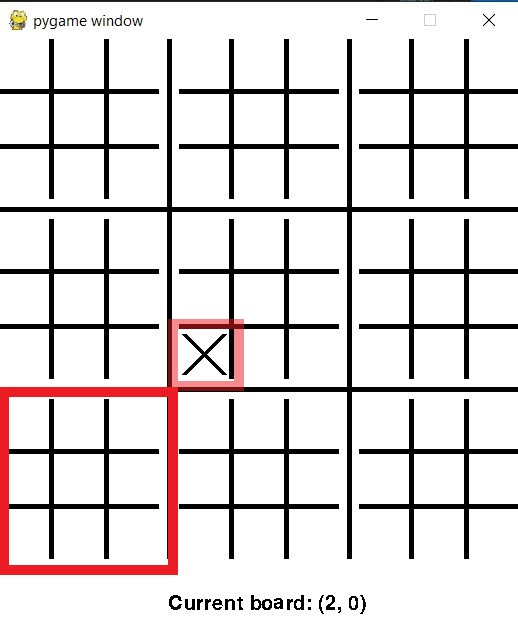

# Ultimate Tic Tac Toe

#### Want to try a new game? Tired of boring Tic Tac Toe? Here is the place you can find something new. The goal of this project is to bring people a visually appealing, easy to use and gamer freindly environment of Ultimate Tic Tac Toe. We wanted to not just make a fun game, but also make the experience easier for our users. By providing this virtual version of Ultimate Tic Tac Toe, our goal was to minimize time wasted drawing the boards and amount of resources needed to make games. We also realized that people may not always have access to a another person to play against. Our goal was then to find a way to allow for a user to play by themselves. The solution was to develop an AI that would be a fun and challenging opponent to play agianst.

## Where to Get Started
* First download the game by either cloning the ultimate-tic-tac-toe repository, or just downloading the files.
* With your terminal of choice, navigate into the ultimate-tic-tac-toe directory (use cd if on windows).
* There are two versions of ultimate tic-tac-toe you can play: text or graphical.

#### In case you wanted to play the text version
* While in the ultimate-tic-tac-toe directory, type in python ultimate_tic_tac_toe_game.py to start the text version.
* Choose if you want to play singleplayer (against an AI) or multiplayer by following the first prompt.
* Type in board coordinates and square coordinates by specifying a row and column. Example: When prompted to choose a board the input 1 1 will select the board in the middle. When prompted to choose a square within a board the input 0 0 will select the square in the top left.

#### Graphical Version Setup
* To start the graphical game, type in python ultimate_tic_tac_toe_pygame.py in the terminal (remember you have to be in ultimate-tic-tac-toe directory.
* Choose singleplayer (against an AI) or multiplayer by clicking the 1 player or 2 player button.

## How to Play

### Ultimate Tic Tac Toe is like regular Tic Tac Toe, except Ultimate!

##### The rules are as follows:

* First player selects what large section they want to start in, then selects a section on the smaller board to place the first mark.

* The second player then has to play on the regular Tic Tac Toe board, that lies in the section corresponding with the spot the first player placed their mark in.

* The players then keep alternating back and forth, playing on the board that corresponds with the other players move.
* You win a board like a regular Tic Tac Toe game, with three marks that lie in a row, column or diagonal.

* You win the Ultimate Tic Tac Toe game, by winning three boards that lie in a row, column or diagonal.

##### Other Rules

* If the previous players mark corresponds to a board that is completely full, or has been won by a player, then the current player can play any board they want.

* If no one can win three boards that lie in a row, column or diagonal, then the Ultimate Tic Tac Toe game results in a draw.

## Playing Features

#### Aesthetic and User Friendly Board
Enjoy a realistic representation of an actual Ultimate Tic Tac Toe board and forget about worrying to type in the coordinates while playing your game. With the visual representation of an Ultimate Tic Tac Toe Board and easy controls, both provided by pygame, the nuisance of typing into a command line is taken away by a simple click of the mouse. This feature allows for quick, easy, seamless and fun play in a realistic environment.

#### Single Player VS AI
Alone with no one to play? No worries because there is a solution for you. Challenge yourself and play agaisnt our own AI system. See if you can beat the algorythm and prove whether or not computers are smarter then humans.

### Video
<iframe width="640" height="480" src="https://drive.google.com/file/d/12DNCBdYJ0pvZacyzL9o9XGq_5EXs_Ca3/preview" allow="autoplay"></iframe>

### Link to Ultiamte Tic Tac Toe's GitHub Page:
[Download Link](https://github.com/olincollege/ultimate-tic-tac-toe)

## Creators

### Marc Eftimie
* From Laguna Beach, California
* Student at Olin College of Engineering studying electrical and computer engineering.
* My favorite food is fettuccine alfredo pasta (from trader joes).

### Kenta Burpee
* From Tokyo, Japan
* Student at Olin College of Engineering studying electrical and computer engineering.
* My favorite food is pork and kimchi fried rice.

### Satchel Sevenau
* From Bay Area, CA.
* Student at Olin College of Engineering studying engineering with computing.
* My favorite food is tacos.

## External Resources Used:
* Home page of pygame documentation: https://www.pygame.org/docs/
* Creating Tic Tac Toe board example in pygame by GeeksforGeeks: https://www.geeksforgeeks.org/tic-tac-toe-gui-in-python-using-pygame/
